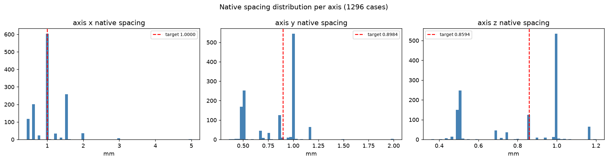
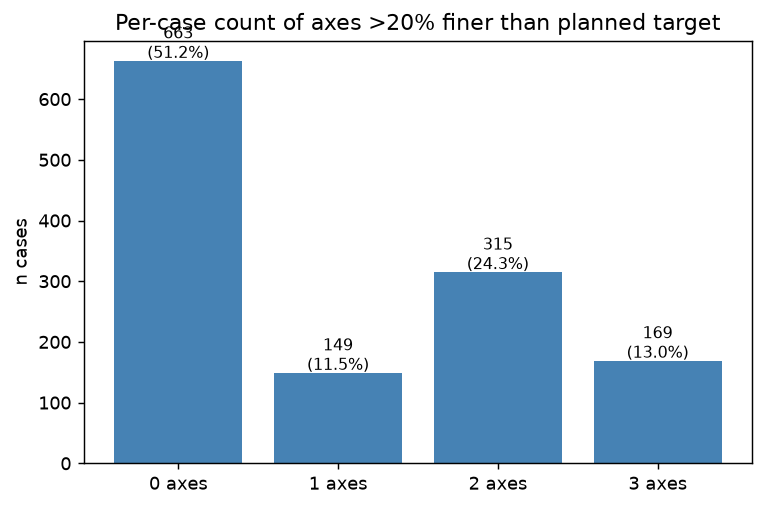

# Ideas

## Training Strategy

**Baseline: ResEncUNetM, standard Dice+CE loss, 1000 epochs.**
ResEncUNetM was chosen over ResEncUNetL because the auto-planned patch for L (`128×224×256`) was nearly full-volume and impractically slow (~325s/epoch on RTX 3090). M auto-plans to `96×160×160` (~105s/epoch), which is 3× faster while still covering ~55% of the brain per patch.

From this baseline we will branch into loss experiments (keeping architecture fixed):
1. Per-class loss weighting (inverse voxel frequency)
2. Focal loss (replace CE)
3. Auxiliary TC + WT region losses
4. Combinations of the above

Fine-tuning from the baseline checkpoint avoids retraining from scratch for each experiment.

---

## Registration

Register all cases to a common space** — the mix of native-space (1268) and SRI24-space (328) cases may be hurting consistency. Registering everything to SRI24 could improve generalization.

## CC Filtering (Connected Component Filtering)

After prediction, run CC labeling per class and delete any predicted blob smaller than threshold `k` voxels.

## High-Resolution Training for Small Lesion Detection

nnUNet resamples all cases to the median spacing `[1.0, 0.899, 0.859]`mm. At 1mm, a 27mm³ lesion is only 27 voxels (3×3×3 cube) — a single voxel error is catastrophic.

**Key finding from fingerprint (1296 cases, 62 distinct spacings):**
- Min native spacing: 0.43×0.36×0.36mm — sub-mm cases lose 31× voxels when upsampled to 1mm
- Median spacing: ~1mm (majority of cases already near 1mm, SRI24 space)
- 1268 cases are in native space; 328 in SRI24 1mm³

**Options:**

1. **Full high-res model at 0.5mm** — 8× more voxels per lesion. Constraint: patch size must shrink to fit in 24GB VRAM (batch=1, smaller patch). Retraining required.

2. **Sub-mm specialist model** — train a separate model only on the sub-mm native-space cases, at their native resolution. Use it to re-segment small lesions found by the main model. More targeted than option 1.

3. **Ensemble + TTA first (free)** — more prediction votes per voxel smooths probability maps near tiny lesions. Try this before any architectural change.

**Verdict:** Ensemble + TTA is the free win. High-res training helps mainly sub-mm cases (a subset of the dataset). Biggest ROI if small-lesion F1 is still poor after ensembling.

**Update (2026-07-10) — precise per-axis breakdown vs the actual planned target `[1.0, 0.8984, 0.8594]`mm:**
Defining "significantly more detailed" as native spacing >20% finer than the planned target on that axis:

| Axis | Cases >20% finer than target |
|---|---|
| x | 323/1296 (24.9%) |
| y | 486/1296 (37.5%) |
| z | 477/1296 (36.8%) |

- **Any axis >20% finer: 633/1296 (48.8%)** — nearly half the dataset has real native detail discarded by resampling, not just an isolated slice-thickness effect.
- **All three axes >20% finer: 169/1296 (13.0%)** — a meaningful minority are genuinely high-res on every axis, not just thin-slice artifacts.
- Per-case axis count: 51.2% have 0 finer axes (nothing lost), 11.5% have 1, 24.3% have 2, 13.0% have 3.

This is a bigger fraction of the dataset than the earlier "sub-mm is a small subset" framing suggested — worth re-weighing option 1/2 against ensemble+TTA once ensemble results are in, rather than assuming high-res only matters for a minority of cases.

Full analysis notebook: `eda/spacing_analysis.ipynb`.

The per-axis histogram shows *why* it's the y/z axes carrying the effect: x is tightly clustered right at the 1.0mm target, but y and z each have a large cluster sitting at ~0.5mm, well below their ~0.9/0.86mm targets. That points to a cheaper option than full 0.5mm isotropic:

4. **Anisotropic high-res model at `[1, 0.5, 0.5]`mm** — keep x at its current target (already matches most cases, nothing to gain there) and only sharpen y/z to 0.5mm, where the real discarded detail actually lives. ~4× more voxels per lesion instead of 8×, meaningfully cheaper on patch size/VRAM than option 1 while still targeting the axes that matter. Worth checking whether the x/y/z axis order used here needs to be re-derived per case if left/right or slice-direction labeling isn't consistent across sites — the fingerprint stats are per-axis in file order, not necessarily anatomically consistent across all 1296 cases.

---

## Loss Function Improvements

**1. Per-class loss weighting**
By voxels across 1296 cases: SNFH=79.6%, ET=14.5%, NETC=4.2%, RC=1.7%. Loss is dominated by SNFH voxels; NETC and RC are starved of gradient. Add weights proportional to inverse voxel frequency e.g. `[1, 19, 1, 5.5, 47]` (bg/NETC/SNFH/ET/RC) in a custom trainer. Low effort.

**2. Focal loss**
Downweights easy voxels (correctly predicted background), upweights hard ones (small lesion boundaries). Loss is dominated by large background + SNFH — focal loss rebalances gradient toward tiny ET/NETC voxels. Replace CE with focal CE in the compound loss.

**3. Size-weighted voxel loss**
Weight each voxel's loss by `1/sqrt(component_size)`. Small lesions get larger gradient contribution. More targeted than focal loss — explicitly penalises missed small structures.

**4. Auxiliary region losses (TC + WT)**
Add DSC loss on TC (NETC+ET) and WT (NETC+SNFH+ET) on top of the existing per-label loss, computed by summing the relevant softmax channels before taking Dice. No architecture change — just extra loss terms. Directly targets the challenge evaluation regions. Expected gain: +0.01–0.02 DSC.

Note: full region-based training (replacing per-label outputs with ET/TC/WT binary outputs) is not recommended for MET. Reasons: (1) nesting is imperfect — 228/650 cases have no NETC, making TC≈ET; (2) RC sits outside the ET/TC/WT hierarchy and needs parallel handling; (3) reconstruction artifacts when TC and ET don't nest cleanly in small lesions. Auxiliary losses capture the benefit without the complexity.

**5. Topology-aware loss**
Penalises missed connected components via persistence diagrams. Directly optimises lesion-wise F1. High complexity — libraries: `TopoLoss`, `cubical-ripser`. High ceiling.

**Recommendation:** Start with (1) + (2) — few lines in a custom trainer, directly targets RC/NETC starvation and small-lesion blindness.

---

## Patch Sampling Improvements

**The core problem:** nnUNet's foreground oversampling picks uniformly from foreground *voxels*. A 27,000mm³ lesion has 1000× more voxels than a 27mm³ one — and gets 1000× more centered patches. NETC/RC are starved of training signal.

**1. Class-uniform foreground sampling** (low effort)
At each foreground sample, first pick a class uniformly at random (NETC/SNFH/ET/RC), then pick a random voxel of that class. NETC and RC get equal frequency to SNFH despite having far fewer voxels. Override `get_do_oversample` in a custom trainer.

**2. Instance-uniform sampling** (medium effort, high impact)
Sample uniformly from foreground *instances* (connected components), not voxels. Every lesion — 27mm³ or 27,000mm³ — gets equal chance of being the patch center. Precompute CC centroids per case, sample from those at training time.

**3. Small-lesion biased sampling** (medium effort)
Weight sampling probability of each foreground voxel by `1/component_size`. Tiny lesions get disproportionately high sampling weight. More aggressive than class-uniform.

**4. Hard patch mining** (medium effort)
After first few hundred epochs, identify worst-performing cases by per-case Dice. Sample those cases more frequently in subsequent epochs.

**Recommendation:** Class-uniform sampling (1) is fastest — a few lines in a custom trainer. Instance-uniform (2) is the most principled fix for size imbalance. Combine both.

---

## Augmentation

### Copy-Paste for Small Lesions
Extract small ET instances from one case, paste them into another at plausible brain locations
(inside brain mask, no overlap with existing lesions). Applied online before the existing
augmentation pipeline. Directly creates more training signal for the rare/small-lesion regime
that drives most FN detections. The model's small-lesion failure is fundamentally a data
scarcity problem (p50 lesion = 143mm³ = 27 voxels), not a model capacity problem.

**Implementation:** pre-extract a bank of small instance patches + masks from the training set;
at each training iteration randomly insert 0–k of them into the current case before cropping
the patch. Needs care to avoid pasting inside ventricles or outside brain.

### Intensity Augmentation — Enhancement Channel Consistency
nnUNet applies brightness/contrast augmentation independently per channel by default.
For the enhancement channels (T1c−T1n subtraction, T1c/T1n ratio) this corrupts the signal:
shifting T1c and T1n independently destroys the difference/ratio that encodes enhancement.
Check whether nnUNet augments channels jointly or independently and, if independent,
apply brightness/gamma jointly to the raw modalities before computing the derived channels,
or exclude derived channels from per-channel intensity augmentation.

### Deformation Field Bank
Pre-compute deformable registration fields between N randomly paired training cases (ANTs or
SimpleElastix). Store fields on disk. During training, randomly sample and apply one as an
additional warp on top of nnUNet's elastic augmentation. Captures real anatomical variability
(brain shape, sulcal patterns) rather than synthetic random elastic warps. Medium complexity —
precomputation takes hours; augmentation step is cheap (just apply a stored field).
nnUNet's default elastic deformation likely covers most of this for brain MRI, so ROI is
moderate.

### Longitudinal Pair Augmentation (UCSD-specific)
The UCSD subset has 646 longitudinal scans of the same patients across timepoints. Registering
each patient's timepoints to each other yields deformation fields encoding *real tumor
progression and regression*: lesions appearing, growing, shrinking, disappearing. Applying
these fields to the paired case synthesizes realistic intermediate tumor states. Unique to this
dataset — could meaningfully help with appearance variability of small/new lesions.
**Prerequisite:** identify patient groupings in the UCSD data from filenames (unknown if IDs
encode patient identity). High complexity; high ceiling if groupings are recoverable.

---

## Enhancement Detection Channels

### Implemented: T1c − T1n subtraction (channel 4)
Added via `--add_subtraction` flag in `convert_to_nnunet.py`. Positive = enhancing (ET), near-zero = non-enhancing tissue (NETC/SNFH), negative = void/fluid (RC, CSF). Directly encodes the enhancement signal the model otherwise has to infer from 4 separate channels.

### Idea: T1c / (T1n + ε) enhancement ratio (channel 5)
Multiplicative ratio is more robust than raw difference to inter-subject intensity scaling differences. ET → strongly >1, non-enhancing tissue → ≈1, cavities → <1. Worth comparing against the subtraction channel — ratio may generalise better across sites with different scanner gain settings. Implement alongside or instead of subtraction once subtraction results are available.
